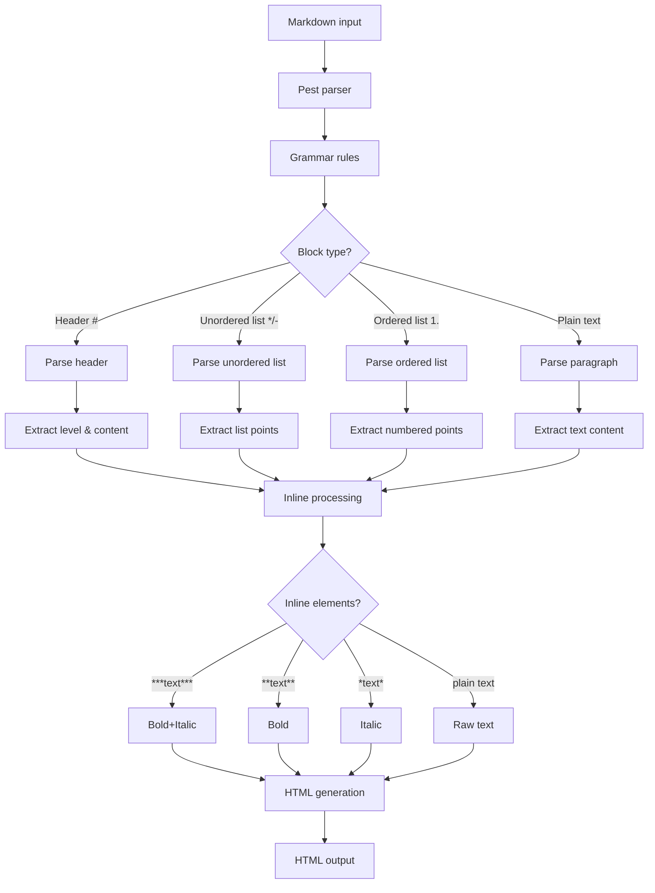
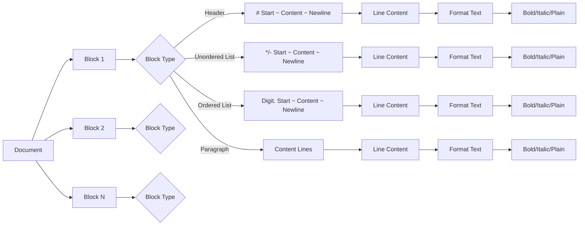

# MD Parser

A simple Markdown parser written in Rust using the **pest** parsing expression grammar library. This parser converts basic Markdown syntax into corresponding HTML tags. `md-parser` handles essential Markdown elements like headings, bold text, italic text and lists.

## Features

- **Headers**: Support for H1-H6 headings (e.g., `# Heading`, `## Subheading`)
- **Text Formatting**: Bold (`**text**`), italic (`*text*`) and bold-italic (`***text***`) styling
- **Lists**: Both unordered (`- point` or `* point`) and ordered (`1. point`) list points
- **Paragraphs**: Plain text handling

## Technical Description

### Parsing Process

This Markdown parser implements a two-stage transformation process:

1. **Lexical Analysis**: The pest parser tokenizes the input Markdown text according to formal grammar rules. The parser recognizes structural patterns like headings, formatting markers, list markers and paragraph boundaries.

2. **HTML Generation**: The parsed tokens are traversed and converted into corresponding HTML elements. Each Markdown element maps to its HTML equivalent:

| Markdown element | Example | HTML Equivalent |
|-----------------|---------|-----------------|
| H1-H6 headers | `# Title`, `## Subtitle` | `<h1>...</h1>`, `<h2>...</h2>` |
| Bold text | `**bold**` | `<b>bold</b>` |
| Italic text | `*italic*` | `<i>italic</i>` |
| Bold-Italic test | `***bold-italic***` | `<b><i>bold-italic</i></b>` |
| Unordered lists | `* point 1`, `- point 2` | `<ul><li>point 1</li></ul>` |
| Ordered lists | `1. point 1`, `2. point 2` | `<ol><li>point 1</li></ol>` |
| Plain text | text | `<p>text</p>` |

### Parsing Flow Graph



### Grammar Definition

The parser uses a formal grammar defined in `src/grammar.pest` using pest's PEG syntax. This grammar precisely defines the structure of supported Markdown elements:

```pest
document = { SOI ~ block* ~ EOI }

block = { header | unordered_list | ordered_list | paragraph }

header = { header_start ~ line_content ~ new_line }
unordered_list = { unordered_list_point+ }
ordered_list = { ordered_list_point+ }
paragraph = { paragraph_line+ }
...
```

### Grammar Structure Visualization



## Usage

The parsed HTML output can be used for:

- **Web Content Rendering**: Direct display in web applications
- **Static Site Generation**: Converting Markdown documentation to HTML

### Commands

```bash
# Parse a markdown file and output HTML to console
cargo run parse document.md

# Save HTML output to a file
cargo run parse document.md --output result.html

# Show help information
cargo run help

# Show project credits
cargo run credits
```

## Development

### Building

```bash
cargo build
```

### Running Tests

The project includes unit tests in the `tests/` folder that verify correct parsing of individual elements, handling of invalid syntax.

```bash
cargo test
```

#### Test Example

```rust
#[test]
fn test_parse_line_content() -> Result<()> {
    let input = "**bold** and *italic* text";
    let pair = MarkdownParser::parse(Rule::line_content, input)?
        .next()
        .ok_or_else(|| anyhow!("no pair"))?;

    assert_eq!(pair.as_str(), input);

    Ok(())
}
```

### Dependencies

- **pest**: Parsing expression grammar library
- **pest_derive**: Macro support for pest grammars
- **anyhow**: Error handling with context
- **thiserror**: Error type implementation
